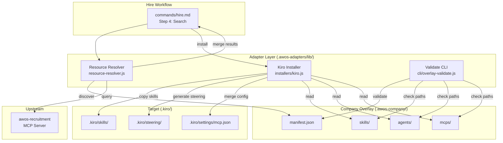

# Design Document: Company Resource Overlay

## Overview

The Company Resource Overlay enables implementing companies to provide project-local skills, agents, and MCP server configurations that the AWOS hire workflow discovers and installs alongside upstream registry resources. The system follows an overlay pattern — company resources augment the upstream `awos-recruitment` registry without modifying any base repository files.

The design introduces three key components:

1. **Resource Resolver** — A pure-Node.js module in `.awos-adapters/lib/` responsible for discovering `.awos-company/manifest.json`, validating the manifest schema, matching resources against search queries, and merging results with upstream registry output.
2. **Kiro Installer Extension** — An `installOverlay` function added to `.awos-adapters/lib/installers/kiro.js` that copies skills, generates agent steering files, and merges MCP configs into `.kiro/`.
3. **Validation CLI** — A standalone command (`npx awos overlay validate`) that runs schema and path checks against the overlay registry.

### Design Rationale

- **Filesystem-only discovery** — No network call for overlay resources; the resolver reads `.awos-company/manifest.json` synchronously, keeping discovery latency near zero and enabling fully offline company setups.
- **Additive-only integration** — The overlay never removes or modifies base repo files. Merging happens at the result-set level (search) and the configuration level (mcp.json).
- **Fail-soft semantics** — Invalid manifest entries produce warnings to stderr and are skipped; the workflow continues with whatever is valid. Only a completely unparseable manifest halts overlay discovery.

## Architecture



### Module Boundaries

| Module | Responsibility | Dependencies |
| -------- | --------------- | -------------- |
| `resource-resolver.js` | Manifest loading, schema validation, search matching, result merging | `node:fs`, `node:path` |
| `installers/kiro.js` (extended) | `installOverlay()` — copies skills, generates agent steering, merges MCP JSON | `node:fs/promises`, `node:path`, `resource-resolver.js` |
| `cli/overlay-validate.js` | CLI entry point for `npx awos overlay validate` | `resource-resolver.js` |

## Components and Interfaces

### Resource Resolver (`resource-resolver.js`)

```javascript
/**
 * @typedef {Object} ResourceEntry
 * @property {string} name - Lowercase alphanumeric + hyphens/underscores, 1-128 chars
 * @property {'skill'|'agent'|'mcp'} type - Resource category
 * @property {string} path - Relative path from .awos-company/ root (no ".." segments)
 * @property {string} [description] - Optional description, max 256 chars
 * @property {string[]} [tags] - Optional tags array, max 20 entries, each max 64 chars
 */

/**
 * @typedef {Object} Manifest
 * @property {ResourceEntry[]} resources - Array of resource declarations
 */

/**
 * @typedef {Object} ResolvedResource
 * @property {string} name
 * @property {'skill'|'agent'|'mcp'} type
 * @property {string} absolutePath - Full resolved path on disk
 * @property {string} [description]
 * @property {string[]} [tags]
 * @property {'company'|'registry'} source - Origin indicator
 */

/**
 * @typedef {Object} DiscoveryResult
 * @property {ResolvedResource[]} resources - Valid resolved resources
 * @property {string[]} warnings - Non-fatal issues encountered
 * @property {string[]} errors - Fatal issues (manifest unparseable, etc.)
 */

/**
 * @typedef {Object} ValidationResult
 * @property {boolean} valid - Whether manifest passes all checks
 * @property {Object[]} schemaErrors - JSON path + description per violation
 * @property {Object[]} pathErrors - Entry name + unresolved path per missing file
 * @property {number} resourceCount - Number of valid resources found
 */

// Public API
module.exports = {
  discover,        // (projectRoot: string) => DiscoveryResult
  validate,        // (projectRoot: string) => ValidationResult
  matchQuery,      // (resources: ResolvedResource[], query: string) => ResolvedResource[]
  mergeResults,    // (upstream: ResolvedResource[], overlay: ResolvedResource[]) => ResolvedResource[]
};
```

#### `discover(projectRoot)`

1. Check if `.awos-company/manifest.json` exists. If not, return empty result (no warnings).
2. Read and JSON-parse the manifest. If parse fails, return with error.
3. Validate against schema (see Data Models). Collect schema errors.
4. If schema errors exist, return with errors (skip discovery).
5. For each valid entry, resolve the `path` relative to `.awos-company/`.
6. Check file existence. If missing, add warning and skip entry.
7. Check for duplicate names — keep first occurrence, warn on duplicates.
8. Return `DiscoveryResult` with resolved resources and accumulated warnings.

#### `matchQuery(resources, query)`

1. Tokenize query by whitespace into terms.
2. For each resource, check:
   - Does `name` contain any term as a case-insensitive substring? → match
   - Does any entry in `tags` exactly match any term (case-insensitive)? → match
3. Return all matching resources.

#### `mergeResults(upstream, overlay)`

1. Create a name→resource map from overlay resources.
2. Filter upstream: exclude any entry whose `name + type` combo exists in overlay map.
3. Concatenate remaining upstream with all overlay resources.
4. Return merged array.

### Kiro Installer Extension

New export added to `installers/kiro.js`:

```javascript
/**
 * @typedef {Object} OverlayInstallResult
 * @property {string[]} skills - Skill names installed
 * @property {string[]} agents - Agent names installed  
 * @property {string[]} mcps - MCP server names installed
 * @property {string[]} warnings - Non-fatal issues
 * @property {string[]} errors - Fatal issues per resource
 */

/**
 * Install overlay resources into .kiro/ structure.
 * 
 * @param {string} projectRoot
 * @param {ResolvedResource[]} resources - Pre-validated overlay resources
 * @param {Object} [options]
 * @param {boolean} [options.dryRun=false]
 * @returns {Promise<OverlayInstallResult>}
 */
async function installOverlay(projectRoot, resources, options = {}) { }
```

#### Skill Installation Logic

1. Filter resources where `type === 'skill'`.
2. For each skill, read the source file and extract YAML frontmatter.
3. Validate frontmatter has `name` field. If missing, warn and skip.
4. Create `.kiro/skills/{name}/` directory (recursive mkdir).
5. Copy the skill file preserving the source filename.

#### Agent Installation Logic

1. Filter resources where `type === 'agent'`.
2. For each agent, read the source file and extract YAML frontmatter.
3. Extract `skills` field (comma-separated list).
4. Verify each referenced skill exists in either the overlay `skills/` or `.kiro/skills/`.
5. If missing skill found, warn and skip agent.
6. Generate a steering file at `.kiro/steering/{agent-name}.md` with `inclusion: manual` frontmatter.

#### MCP Installation Logic

1. Filter resources where `type === 'mcp'`.
2. For each MCP config, read and JSON-parse the source file.
3. Read existing `.kiro/settings/mcp.json` (or create if missing).
4. For each server key in the MCP config:
   - If key already exists in target, emit warning about conflict (require confirmation in interactive mode, skip in non-interactive).
   - Otherwise, merge the server entry under `mcpServers`.
5. Preserve `${VARIABLE_NAME}` references as literal strings.
6. Write the merged JSON back.

### Validation CLI (`cli/overlay-validate.js`)

Entry point for `npx awos overlay validate`:

```javascript
#!/usr/bin/env node
'use strict';

const { validate } = require('../lib/resource-resolver');

async function main() {
  const projectRoot = process.cwd();
  const result = validate(projectRoot);
  
  if (result.schemaErrors.length > 0) {
    for (const err of result.schemaErrors) {
      process.stderr.write(`Schema error at ${err.path}: ${err.message}\n`);
    }
  }
  
  if (result.pathErrors.length > 0) {
    for (const err of result.pathErrors) {
      process.stderr.write(`Missing path: ${err.name} → ${err.path}\n`);
    }
  }
  
  if (result.schemaErrors.length === 0 && result.pathErrors.length === 0) {
    process.stdout.write(`✓ ${result.resourceCount} resources validated successfully\n`);
    process.exit(0);
  } else {
    process.exit(1);
  }
}

main();
```

Registered in `package.json` via the `bin` field or a scripts entry pointing to `.awos-adapters/lib/cli/overlay-validate.js`.

## Data Models

### Manifest JSON Schema

```json
{
  "$schema": "http://json-schema.org/draft-07/schema#",
  "title": "Company Resource Manifest",
  "type": "object",
  "required": ["resources"],
  "additionalProperties": false,
  "properties": {
    "resources": {
      "type": "array",
      "items": {
        "type": "object",
        "required": ["name", "type", "path"],
        "additionalProperties": false,
        "properties": {
          "name": {
            "type": "string",
            "minLength": 1,
            "maxLength": 128,
            "pattern": "^[a-z0-9][a-z0-9_-]*$"
          },
          "type": {
            "type": "string",
            "enum": ["skill", "agent", "mcp"]
          },
          "path": {
            "type": "string",
            "minLength": 1,
            "not": { "pattern": "(^|/)\\.\\.(/|$)" }
          },
          "description": {
            "type": "string",
            "maxLength": 256
          },
          "tags": {
            "type": "array",
            "maxItems": 20,
            "items": {
              "type": "string",
              "minLength": 1,
              "maxLength": 64
            }
          }
        }
      }
    }
  }
}
```

### Example Manifest

```json
{
  "resources": [
    {
      "name": "winged-commerce-api",
      "type": "skill",
      "path": "skills/winged-commerce-api.md",
      "description": "WingedCommerce internal API patterns and authentication",
      "tags": ["api", "commerce", "internal"]
    },
    {
      "name": "winged-backend-agent",
      "type": "agent",
      "path": "agents/winged-backend-agent.md",
      "description": "Backend specialist with WingedCommerce domain knowledge",
      "tags": ["backend", "node", "commerce"]
    },
    {
      "name": "winged-analytics-mcp",
      "type": "mcp",
      "path": "mcps/winged-analytics.json",
      "description": "WingedCommerce analytics MCP server configuration",
      "tags": ["analytics", "mcp"]
    }
  ]
}
```

### MCP Config File Format

Each file in `.awos-company/mcps/` contains a JSON object with server entries:

```json
{
  "winged-analytics-mcp": {
    "command": "npx",
    "args": ["-y", "@wingedcommerce/analytics-mcp"],
    "env": {
      "ANALYTICS_API_KEY": "${ANALYTICS_API_KEY}",
      "ANALYTICS_ENDPOINT": "https://analytics.wingedcommerce.internal"
    }
  }
}
```

### Target MCP JSON Structure (`.kiro/settings/mcp.json`)

```json
{
  "mcpServers": {
    "existing-server": { "command": "...", "args": [] },
    "winged-analytics-mcp": {
      "command": "npx",
      "args": ["-y", "@wingedcommerce/analytics-mcp"],
      "env": {
        "ANALYTICS_API_KEY": "${ANALYTICS_API_KEY}",
        "ANALYTICS_ENDPOINT": "https://analytics.wingedcommerce.internal"
      }
    }
  }
}
```

### Generated Steering File for Agent

```markdown
---
inclusion: manual
---

# winged-backend-agent

> Backend specialist with WingedCommerce domain knowledge

## Skills

- winged-commerce-api

## Instructions

This agent specializes in WingedCommerce backend development patterns.
Activate with `#winged-backend-agent` in chat.
```

## Correctness Properties

*A property is a characteristic or behavior that should hold true across all valid executions of a system — essentially, a formal statement about what the system should do. Properties serve as the bridge between human-readable specifications and machine-verifiable correctness guarantees.*

### Property 1: Schema Validation Correctness

*For any* JSON object, the manifest schema validator SHALL accept it if and only if it has a `resources` array where every entry contains a `name` matching `^[a-z0-9][a-z0-9_-]*$` (1–128 chars), a `type` in `{"skill", "agent", "mcp"}`, and a `path` containing no `..` traversal segments. Entries missing any required field or having invalid field values SHALL cause the validator to reject with an error referencing the violating field's JSON path.

**Validates: Requirements 2.1, 2.2, 2.6, 2.7, 11.2**

### Property 2: Missing Path Resilience

*For any* valid manifest containing N resource entries where K entries reference paths that do not exist on disk (0 ≤ K ≤ N), the resolver SHALL return exactly N−K resolved resources and exactly K warnings, each identifying the entry name and unresolved path. The resolved resources SHALL contain only entries whose paths exist.

**Validates: Requirements 1.4, 2.8, 11.3**

### Property 3: Duplicate Name Deduplication

*For any* manifest containing resource entries with duplicate `name` values, the resolver SHALL return only the first occurrence of each name and produce exactly one warning per additional duplicate, identifying the duplicate entry.

**Validates: Requirements 2.5**

### Property 4: Search Query Matching

*For any* resource with name N and tags T, and *for any* query string Q tokenized into terms, `matchQuery` SHALL return that resource if and only if: (a) N contains at least one term as a case-insensitive substring, OR (b) at least one element of T exactly equals at least one term under case-insensitive comparison.

**Validates: Requirements 3.6, 3.7**

### Property 5: Merge Prefers Overlay

*For any* upstream resource list U and overlay resource list O, `mergeResults(U, O)` SHALL return a list where: (a) every resource from O is included, (b) every resource from U whose (name, type) pair does NOT appear in O is included, and (c) no resource from U whose (name, type) pair appears in O is included. The resulting list has length |O| + |U \ duplicates|.

**Validates: Requirements 3.3, 9.3**

### Property 6: Skill Installation Content Preservation

*For any* valid skill resource with a source file containing content C and a manifest name N, after `installOverlay` completes, the file at `.kiro/skills/{N}/{original-filename}` SHALL exist and its content SHALL be byte-identical to C.

**Validates: Requirements 4.2, 4.3, 10.2**

### Property 7: Installation Idempotence

*For any* set of valid overlay resources, calling `installOverlay` twice in succession with the same inputs SHALL produce a filesystem state identical to calling it once, and the second call SHALL produce zero errors.

**Validates: Requirements 4.4, 5.6**

### Property 8: Agent Steering Generation

*For any* valid agent resource declaring skills S₁, S₂, …, Sₖ (all of which exist in the overlay or project), `installOverlay` SHALL generate a steering file at `.kiro/steering/{agent-name}.md` whose content includes `inclusion: manual` in its YAML frontmatter and references each of S₁ through Sₖ.

**Validates: Requirements 5.3, 10.3**

### Property 9: Agent Skill Dependency Check

*For any* agent resource referencing at least one skill name that does not exist in the overlay registry or in `.kiro/skills/`, `installOverlay` SHALL skip that agent, emit a warning identifying the missing skill name, and successfully install all remaining valid resources.

**Validates: Requirements 5.4, 5.5**

### Property 10: MCP Merge Preserves Existing Entries

*For any* existing `.kiro/settings/mcp.json` containing server entries E₁, E₂, …, Eₘ and *for any* new overlay MCP entries N₁, N₂, …, Nₖ where no Nᵢ shares a key with any Eⱼ, the resulting `mcp.json` SHALL contain all of E₁…Eₘ unchanged plus all of N₁…Nₖ under the `mcpServers` key.

**Validates: Requirements 6.3, 10.4**

### Property 11: Environment Variable Reference Preservation

*For any* MCP config containing `env` values with `${VARIABLE_NAME}` syntax, after installation the corresponding entries in `.kiro/settings/mcp.json` SHALL contain those `${...}` references as literal strings, not resolved values.

**Validates: Requirements 6.5**

### Property 12: Protected Paths Invariant

*For any* overlay discovery or installation operation, no file SHALL be created, modified, or deleted under the paths `.awos/`, `commands/`, `plugins/`, `templates/`, or `src/` relative to the project root.

**Validates: Requirements 7.1, 7.5**

### Property 13: Backward Compatibility Without Overlay

*For any* project where `.awos-company/` does not exist, calling the extended `install()` function SHALL produce output identical to calling the pre-extension `install()` (i.e., `installOverlay` returns an empty result and performs no filesystem operations).

**Validates: Requirements 7.4, 10.6**

## Error Handling

### Error Categories

| Category | Trigger | Behavior | User Impact |
| ---------- | --------- | ---------- | ------------- |
| Manifest parse failure | Invalid JSON in manifest.json | Return error, skip overlay entirely | Warning to stderr, workflow continues with upstream only |
| Schema validation failure | Missing/invalid required fields | Report all errors with JSON paths, skip overlay | Errors to stderr with fix guidance |
| Missing file path | Manifest references non-existent file | Skip entry, emit warning | Per-entry warning, other resources proceed |
| Duplicate name | Same name appears twice in manifest | Use first, warn about duplicate | Warning to stderr |
| Invalid skill frontmatter | Skill file lacks YAML frontmatter or `name` | Skip skill, emit warning | Per-skill warning |
| Missing skill dependency | Agent references non-existent skill | Skip agent, emit warning | Per-agent warning |
| MCP conflict | Same server name in overlay and existing config | Warn, skip in non-interactive mode | Warning with server name |
| File copy failure | Permission error, disk full, etc. | Report failure, skip resource, continue | Per-resource error message |
| Directory creation failure | Cannot create target directory | Report error, skip resource | Per-resource error message |

### Error Propagation Strategy

1. **Fail-soft within manifest** — Individual entry failures never halt processing of remaining entries.
2. **Fail-hard on unparseable manifest** — If `manifest.json` cannot be JSON-parsed or has fundamental schema violations (e.g., `resources` is not an array), the entire overlay phase is skipped.
3. **Warnings accumulate** — All warnings are collected and returned in the result object for the caller to present.
4. **Errors vs warnings** — Errors indicate skipped resources; warnings indicate informational issues (duplicates, missing optional paths). Both are reported to stderr.
5. **Exit codes** — The validation CLI uses exit code 0 for success, 1 for any schema/path errors.

### Defensive Measures

- **Path traversal guard** — The resolver rejects any `path` containing `..` segments before attempting file reads.
- **JSON parse safety** — All `JSON.parse` calls are wrapped in try/catch with descriptive error messages.
- **Idempotent writes** — File writes use `mkdir({ recursive: true })` and overwrite semantics to handle partial previous runs.
- **No process.exit in library code** — Only the CLI entry point calls `process.exit`; the library always returns results.

## Testing Strategy

### Testing Framework

- **Test runner:** Node.js built-in test runner (`node --test`) — consistent with existing project tests.
- **Assertions:** `node:assert/strict` — already used throughout the test suite.
- **Property-based testing:** [`fast-check`](https://github.com/dubzzz/fast-check) — the standard PBT library for JavaScript/Node.js.

### Test Organization

```
tests/
  overlay/
    resource-resolver.test.js     # Unit tests for discovery, validation, matching, merging
    resource-resolver.prop.test.js # Property-based tests for resolver
    kiro-overlay.test.js          # Unit tests for installOverlay
    kiro-overlay.prop.test.js     # Property-based tests for installer
    overlay-validate-cli.test.js  # Integration tests for CLI command
  fixtures/
    overlay-valid/                # .awos-company/ with valid manifest
    overlay-invalid/              # .awos-company/ with broken manifest
    overlay-mixed/                # .awos-company/ with some valid, some invalid entries
```

### Property-Based Testing Configuration

- **Library:** `fast-check`
- **Minimum iterations:** 100 per property test
- **Tag format:** `Feature: company-resource-overlay, Property {number}: {title}`

Each correctness property maps to a single property-based test. The generators produce:

- Random valid manifest objects (resource entries with valid names, types, paths)
- Random invalid manifest objects (missing fields, bad types, traversal paths)
- Random query strings with varying term counts
- Random upstream/overlay resource lists with controlled overlap
- Random skill/agent/MCP file contents with valid/invalid frontmatter

### Unit Test Coverage

| Component | Key Test Cases |
| ----------- | --------------- |
| `discover()` | Missing directory, missing manifest, empty manifest, valid manifest, invalid JSON |
| `validate()` | Schema pass, schema fail (each field), path existence checks |
| `matchQuery()` | Single term, multi-term, no match, tag match, name match, case variations |
| `mergeResults()` | No overlap, full overlap, partial overlap, empty inputs |
| `installOverlay()` — skills | Valid skill, missing frontmatter, idempotent reinstall |
| `installOverlay()` — agents | Valid agent, missing skill dep, steering file content |
| `installOverlay()` — MCPs | New entry, conflict, create from scratch, env var preservation |
| CLI | Valid manifest exit 0, invalid manifest exit 1, missing manifest |

### Integration Tests

- End-to-end: set up a temp project with `.awos-company/`, run the full hire workflow discovery + installation, verify `.kiro/` directory state.
- CLI: spawn `node .awos-adapters/lib/cli/overlay-validate.js` and assert stdout/stderr/exit code.
