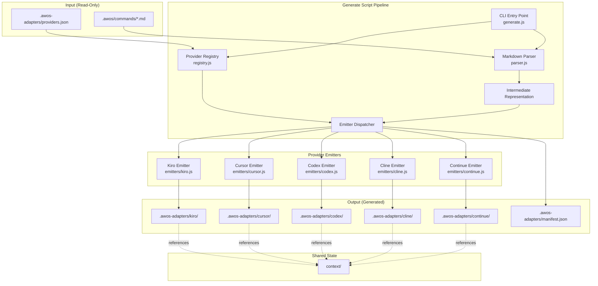

# Design Document: Multi-IDE Adapter Layer

## Overview

The multi-IDE adapter layer implements Option A (Adapter Pattern) from the architecture proposal, enabling AWOS spec-driven workflows to run natively in Kiro, Cursor, Codex, Cline, and Continue without modifying the upstream AWOS framework. A code generation script (`generate.js`) parses canonical AWOS command prompts from `.awos/commands/` into a structured Intermediate Representation (IR), then emits per-IDE adapter files through Provider-specific emitters. All generated output lives in `.awos-adapters/`, keeping the upstream source pristine and rebase-friendly.

The design uses three core patterns:

- **Adapter Pattern** — Each Provider emitter translates a common IR into IDE-native formats
- **Strategy Pattern** — Delegation behavior varies per IDE (subagent spawning vs. sequential prompts)
- **Template Method** — Workflow steps are fixed; only the tool invocation mechanism varies

Key constraints:

- Zero npm dependencies — Node.js 22+ built-in modules only (`node:fs`, `node:path`, `node:test`)
- All generated files stay under 500 lines
- The `context/` directory is shared state across all IDEs
- Upstream directories (`commands/`, `templates/`, `scripts/`, `src/`) are never modified

## Architecture



### Directory Layout

```text
.awos-adapters/
├── generate.js              # CLI entry point (≤500 lines)
├── lib/
│   ├── parser.js            # Markdown → IR parser
│   ├── ir.js                # IR data structures and serialization
│   ├── registry.js          # Provider detection and routing
│   ├── splitter.js          # File size enforcement (500-line split)
│   ├── validator.js         # Structural validation per Provider
│   └── emitters/
│       ├── base-emitter.js  # Shared emitter utilities
│       ├── kiro.js          # Kiro steering/hooks emitter
│       ├── cursor.js        # Cursor rules/commands emitter
│       ├── codex.js         # Codex task definitions emitter
│       ├── cline.js         # Cline rules/memory-bank emitter
│       └── continue.js      # Continue config/commands emitter
├── providers.json           # Enabled Providers configuration
├── manifest.json            # Generation metadata (auto-generated)
├── README.md                # Upstream-is-king policy documentation
├── tests/
│   ├── parser.test.js       # Parser unit + property tests
│   ├── ir.test.js           # IR round-trip tests
│   ├── emitters.test.js     # Emitter snapshot tests
│   ├── splitter.test.js     # File splitting tests
│   ├── validator.test.js    # Validation rule tests
│   └── fixtures/            # Known command fixtures for regression
│       └── implement.md
├── kiro/
│   └── steering/            # Generated Kiro steering files
├── cursor/
│   └── rules/               # Generated Cursor rules
├── codex/
│   └── tasks/               # Generated Codex task files
├── cline/
│   ├── rules/               # Generated Cline rules
│   └── memory-bank/         # Generated memory bank templates
└── continue/
    └── config/              # Generated Continue configuration
```

## Components and Interfaces

### 1. CLI Entry Point (`generate.js`)

Parses command-line arguments and orchestrates the pipeline.

```javascript
// Public interface
/**
 * @param {string[]} argv - Process arguments
 * @returns {Promise<{exitCode: number, summary: GenerationSummary}>}
 */
async function main(argv);

// CLI flags:
// --provider {name}   Generate only the specified Provider
// --dry-run           Report without writing files
// --dump-ir           Serialize IR to stdout as JSON
// --detect            Report detected Providers, no generation
// --validate          Run structural validation on existing output
// (no args)           Regenerate all enabled Providers
```

### 2. Markdown Parser (`lib/parser.js`)

Parses AWOS command prompts into structured IR objects.

```javascript
/**
 * @typedef {Object} ParseResult
 * @property {CommandIR} ir - The parsed intermediate representation
 * @property {ParseWarning[]} warnings - Non-fatal parse issues
 */

/**
 * Parse a single AWOS command markdown file into IR.
 * @param {string} filePath - Absolute path to the command .md file
 * @param {string} content - Raw markdown content
 * @returns {ParseResult}
 * @throws {ParseError} When file structure is malformed beyond recovery
 */
function parseCommand(filePath, content);

/**
 * Parse all command files in a directory.
 * @param {string} commandsDir - Path to .awos/commands/
 * @returns {Promise<{commands: ParseResult[], errors: ParseError[]}>}
 */
async function parseAllCommands(commandsDir);
```

### 3. Intermediate Representation (`lib/ir.js`)

Data structures representing a parsed command in provider-neutral form.

```javascript
/**
 * @typedef {Object} CommandIR
 * @property {string} name - Command name (derived from filename)
 * @property {Frontmatter} frontmatter - Extracted YAML frontmatter
 * @property {RoleSection} role - The ROLE section content
 * @property {TaskSection} task - The TASK section content
 * @property {IOSection} io - INPUTS & OUTPUTS section
 * @property {InteractionSection} interaction - INTERACTION section
 * @property {ProcessSection} process - The PROCESS section with steps
 * @property {ToolReference[]} toolReferences - Tagged Claude Code tool calls
 */

/**
 * @typedef {Object} ToolReference
 * @property {'Agent'|'Read'|'Glob'|'AskUserQuestion'|'Explore'|'Plan'} tool
 * @property {string} context - Surrounding text for translation context
 * @property {number} lineNumber - Source location for diagnostics
 * @property {Object} parameters - Extracted tool parameters (if parseable)
 */

/**
 * @typedef {Object} ProcessStep
 * @property {number} stepNumber
 * @property {string} title
 * @property {string} body - Markdown content of the step
 * @property {ToolReference[]} toolReferences - Tools used in this step
 * @property {DelegationCall[]} delegations - Agent delegation calls
 */

/**
 * Serialize IR to JSON (for --dump-ir and round-trip testing).
 * @param {CommandIR} ir
 * @returns {string} JSON string
 */
function serialize(ir);

/**
 * Deserialize JSON back to CommandIR.
 * @param {string} json
 * @returns {CommandIR}
 */
function deserialize(json);
```

### 4. Provider Registry (`lib/registry.js`)

Manages Provider detection and configuration.

```javascript
/**
 * @typedef {Object} ProviderConfig
 * @property {string} name - Provider identifier (kebab-case)
 * @property {boolean} enabled - Whether generation is active
 * @property {string[]} markers - Filesystem markers for detection
 * @property {string} emitterModule - Path to emitter module
 */

/**
 * Load provider configuration from providers.json.
 * @param {string} configPath
 * @returns {ProviderConfig[]}
 */
function loadProviders(configPath);

/**
 * Detect which Providers are active based on project markers.
 * @param {string} projectRoot
 * @returns {DetectedProvider[]}
 */
function detectProviders(projectRoot);
```

### 5. Base Emitter Interface (`lib/emitters/base-emitter.js`)

Shared utilities and the contract all emitters follow.

```javascript
/**
 * @typedef {Object} EmitResult
 * @property {GeneratedFile[]} files - Files to write
 * @property {EmitWarning[]} warnings - Non-fatal issues
 */

/**
 * @typedef {Object} GeneratedFile
 * @property {string} relativePath - Path relative to .awos-adapters/{provider}/
 * @property {string} content - File content to write
 * @property {number} lineCount - Pre-computed line count
 */

/**
 * @typedef {Object} DelegationStrategy
 * @property {string} type - 'subagent'|'sequential'|'manual'
 * @property {function(DelegationCall): string} translate - Translates a delegation
 */

/**
 * Base emitter contract — each Provider emitter exports this shape.
 * @param {CommandIR} ir - Parsed command
 * @param {EmitterOptions} options - Provider-specific config
 * @returns {EmitResult}
 */
function emit(ir, options);
```

### 6. File Splitter (`lib/splitter.js`)

Enforces the 500-line file size constraint.

```javascript
/**
 * Split a generated file if it exceeds maxLines.
 * @param {GeneratedFile} file
 * @param {number} maxLines - Default 500
 * @returns {GeneratedFile[]} - Original file or split parts
 */
function splitIfNeeded(file, maxLines);
```

### 7. Validator (`lib/validator.js`)

Validates generated output against Provider-specific structural rules.

```javascript
/**
 * @typedef {Object} ValidationRule
 * @property {string} provider
 * @property {string} description
 * @property {function(GeneratedFile): ValidationViolation|null} check
 */

/**
 * Validate all generated files for a Provider.
 * @param {string} provider
 * @param {GeneratedFile[]} files
 * @returns {ValidationViolation[]}
 */
function validate(provider, files);
```

## Data Models

### Intermediate Representation Schema

The IR is the central data structure bridging parsing and emission. It is serializable to JSON for debugging and round-trip validation.

```json
{
  "name": "implement",
  "frontmatter": {
    "description": "Runs tasks — delegates coding to sub-agents, tracks progress.",
    "argumentHint": null
  },
  "role": {
    "title": "Lead Implementation Agent",
    "description": "You are a Lead Implementation Agent...",
    "rules": []
  },
  "task": {
    "goal": "Execute the pending work for a given specification...",
    "body": "..."
  },
  "io": {
    "inputs": [
      { "name": "User Prompt", "optional": true, "source": "$ARGUMENTS" }
    ],
    "outputs": [
      { "name": "tasks.md", "description": "Updated with completed checkboxes" }
    ],
    "contextFiles": [
      "context/spec/[index]-[name]/functional-spec.md",
      "context/spec/[index]-[name]/technical-considerations.md",
      "context/spec/[index]-[name]/tasks.md"
    ]
  },
  "interaction": {
    "tools": ["AskUserQuestion"],
    "notes": "Use for multiple-choice questions"
  },
  "process": {
    "steps": [
      {
        "stepNumber": 1,
        "title": "Identify the Target Specification and Load Static Context",
        "body": "...",
        "toolReferences": [
          { "tool": "Read", "context": "Read tasks.md", "lineNumber": 45 }
        ],
        "delegations": []
      },
      {
        "stepNumber": 3,
        "title": "Delegate Implementation to a Subagent",
        "body": "...",
        "toolReferences": [
          { "tool": "Agent", "context": "Agent(subagent_type=...)", "lineNumber": 72, "parameters": { "subagent_type": "<agent-name>" } }
        ],
        "delegations": [
          { "agentType": "<agent-name>", "promptTemplate": "..." }
        ]
      }
    ]
  },
  "toolReferences": [
    { "tool": "Agent", "context": "...", "lineNumber": 72, "parameters": {} },
    { "tool": "Read", "context": "...", "lineNumber": 45, "parameters": {} },
    { "tool": "AskUserQuestion", "context": "...", "lineNumber": 30, "parameters": {} }
  ]
}
```

### Provider Configuration (`providers.json`)

```json
{
  "providers": [
    {
      "name": "kiro",
      "enabled": true,
      "markers": [".kiro/"],
      "emitter": "./lib/emitters/kiro.js"
    },
    {
      "name": "cursor",
      "enabled": true,
      "markers": [".cursor/"],
      "emitter": "./lib/emitters/cursor.js"
    },
    {
      "name": "codex",
      "enabled": false,
      "markers": ["codex.json", ".codex/"],
      "emitter": "./lib/emitters/codex.js"
    },
    {
      "name": "cline",
      "enabled": false,
      "markers": [".clinerules", ".cline/"],
      "emitter": "./lib/emitters/cline.js"
    },
    {
      "name": "continue",
      "enabled": false,
      "markers": [".continue/"],
      "emitter": "./lib/emitters/continue.js"
    }
  ]
}
```

### Generation Manifest (`manifest.json`)

```json
{
  "generatedAt": "2025-01-15T10:30:00.000Z",
  "nodeVersion": "22.0.0",
  "sourceHash": "sha256:abc123...",
  "providers": {
    "kiro": {
      "fileCount": 9,
      "totalLines": 1842,
      "generatedAt": "2025-01-15T10:30:00.000Z"
    },
    "cursor": {
      "fileCount": 11,
      "totalLines": 2105,
      "generatedAt": "2025-01-15T10:30:00.000Z"
    }
  }
}
```

### Delegation Strategy Mapping

Each Provider defines how `Agent` tool calls are translated:

| Provider | Strategy Type | Translation |
| --- | --- | --- |
| Kiro | `subagent` | `invoke_sub_agent` with `general-task-execution` agent type |
| Cursor | `sequential` | Composer prompts with explicit `@-file` context reloading per task |
| Codex | `sequential` | `codex --auto` invocations with `--context-file` references |
| Cline | `sequential` | Task execution instructions with memory bank state updates |
| Continue | `sequential` | Custom slash command iterating tasks as individual prompts |

### Tool Translation Matrix

| Claude Code Tool | Kiro | Cursor | Codex | Cline | Continue |
| --- | --- | --- | --- | --- | --- |
| `Agent(...)` | `invoke_sub_agent` | Sequential composer prompts | Sequential `codex --auto` | Sequential tasks + memory bank | Slash command iteration |
| `Read(path)` | `read_file` tool | `@path` reference | Context file arg | File read instruction | Context provider |
| `Glob(pattern)` | `file_search` tool | `@folder` reference | Glob in task description | File listing instruction | Context provider glob |
| `AskUserQuestion` | Plain-text chat prompt | Composer question | Interactive prompt | Chat question | Slash command prompt |
| `Explore` | `context-gatherer` agent | Composer "explore" prompt | Context file listing | Plan mode investigation | Context gather prompt |
| `Plan` | Task planning prompt | Composer planning prompt | Task planning instruction | Plan mode prompt | Planning slash command |

## Correctness Properties

*A property is a characteristic or behavior that should hold true across all valid executions of a system — essentially, a formal statement about what the system should do. Properties serve as the bridge between human-readable specifications and machine-verifiable correctness guarantees.*

### Property 1: Parsing completeness

*For any* valid AWOS command markdown file containing ROLE, TASK, INPUTS & OUTPUTS, INTERACTION, and PROCESS sections with valid YAML frontmatter, parsing it SHALL produce an IR containing all sections with their content and all frontmatter fields correctly populated.

**Validates: Requirements 2.1, 2.2, 2.4**

### Property 2: Tool reference identification

*For any* AWOS command markdown containing references to Claude Code tools (Agent, Read, Glob, AskUserQuestion, Explore, Plan), the parser SHALL identify and tag every tool reference with its tool type, surrounding context, and source line number.

**Validates: Requirements 2.3**

### Property 3: Error resilience under malformed input

*For any* batch of command files where some are malformed (missing required sections, invalid frontmatter), the parser SHALL produce valid IR for all well-formed files and report errors (including file path) for each malformed file without aborting.

**Validates: Requirements 2.5**

### Property 4: IR serialization round-trip

*For any* valid CommandIR object, serializing to JSON and then deserializing SHALL produce an equivalent IR, and emitting from the deserialized IR SHALL produce output identical to emitting from the original IR.

**Validates: Requirements 3.2, 3.3**

### Property 5: Tool translation correctness per Provider

*For any* Provider emitter and any IR containing Claude Code tool references, the emitted output SHALL contain the Provider-native equivalent for each tool reference (per the tool translation matrix) and SHALL NOT contain raw Claude Code tool syntax.

**Validates: Requirements 4.2, 4.3, 5.2, 5.3, 6.2, 7.2, 7.3, 8.2, 8.4**

### Property 6: Path reference integrity

*For any* emitted adapter file from any Provider, all references to project documents SHALL use workspace-relative `context/` paths, and all generated file paths SHALL be contained within `.awos-adapters/`.

**Validates: Requirements 4.5, 5.4, 6.3, 8.3, 10.1, 10.2**

### Property 7: File size invariant

*For any* generated output file from any Provider emitter, the file SHALL NOT exceed 500 lines. When the pre-split content exceeds 500 lines, the splitter SHALL produce multiple files each ≤500 lines following the naming convention `{command}-{section}.md`.

**Validates: Requirements 4.6, 12.1, 12.2**

### Property 8: Process step encoding

*For any* CommandIR with N process steps, each Provider emitter SHALL produce output where each process step is addressable as an individual unit (task, instruction, or prompt section), and the count of emitted units SHALL equal the count of process steps in the IR.

**Validates: Requirements 6.4**

### Property 9: Delegation strategy correctness

*For any* Provider, when emitting the implement command's Agent delegation calls, the output SHALL use that Provider's designated delegation pattern (Kiro: invoke_sub_agent, Cursor: sequential composer, Codex: codex --auto, Cline: sequential + memory bank, Continue: slash command iteration) and SHALL include task completion tracking instructions (marking checkboxes in tasks.md).

**Validates: Requirements 9.2, 9.4**

### Property 10: Provider detection accuracy

*For any* project directory containing a combination of IDE marker files/directories, the Provider detector SHALL report exactly the set of Providers whose markers are present — no false positives and no false negatives.

**Validates: Requirements 13.1**

### Property 11: Auto-generated header presence

*For any* file produced by the Generate_Script, the file SHALL begin with a header comment stating "Auto-generated by generate-adapters — do not edit manually".

**Validates: Requirements 14.3**

### Property 12: File size warning threshold

*For any* generated file exceeding 400 lines (but ≤500 lines), the Generate_Script SHALL emit a warning to stderr including the file path and line count.

**Validates: Requirements 12.4**

### Property 13: Structural validation detection

*For any* generated adapter file containing a structural violation of its Provider's rules (wrong file extension, invalid JSON/YAML, incorrect directory nesting), the validator SHALL report the violation with Provider name, file path, and the rule that was violated.

**Validates: Requirements 16.1**

## Error Handling

### Parse Errors

| Error Condition | Behavior | Recovery |
| --- | --- | --- |
| Command file missing required section (ROLE, TASK, PROCESS) | Report `ParseError` with file path and missing section name | Skip file, continue processing remaining commands |
| Invalid YAML frontmatter | Report `ParseError` with file path and YAML parse error | Skip file, continue processing |
| Empty command file | Report `ParseError` with file path | Skip file, continue processing |
| Unrecognized tool reference syntax | Emit `ParseWarning` (non-fatal) | Include raw text in IR, let emitter decide handling |

### Emission Errors

| Error Condition | Behavior | Recovery |
| --- | --- | --- |
| Emitter receives IR with no process steps | Emit empty output with warning | Continue to next command |
| File split produces fragment <10 lines | Merge with adjacent fragment | Log merge decision |
| Provider emitter module not found | Report error for that provider | Skip provider, continue others |

### CLI Errors

| Error Condition | Behavior | Exit Code |
| --- | --- | --- |
| `.awos/commands/` missing or empty | Print descriptive error to stderr | 1 |
| Unknown `--provider` name | Print available providers to stderr | 1 |
| Node.js version <22 | Print version requirement message | 1 |
| `providers.json` missing | Use defaults (Kiro + Cursor enabled) | 0 (proceed with defaults) |
| Uncommitted changes in upstream dirs | Print warning to stderr | 0 (proceed with warning) |
| File write permission denied | Report file path and error | 1 |

### Validation Errors

The `--validate` flag performs structural checks and reports all violations in a single run (does not fail-fast). Each violation includes:

- Provider name
- File path (relative to `.awos-adapters/`)
- Rule description
- Suggested fix (when deterministic)

Exit code is 0 when all validations pass, 1 when any violation is found.

## Testing Strategy

### Test Infrastructure

- **Test runner**: Node.js 22+ built-in `node:test`
- **Assertions**: `node:assert/strict`
- **Property-based testing**: Custom lightweight PBT harness using `node:crypto` for randomness (no external dependencies per project constraint)
- **Fixtures**: Known AWOS command files stored in `.awos-adapters/tests/fixtures/`
- **Snapshot testing**: Expected output files stored alongside fixtures for regression comparison

### Test Layers

#### Layer 1: Property-Based Tests (Universal Properties)

Property-based tests validate the 13 correctness properties defined above. Each property test:

- Runs minimum 100 iterations with generated inputs
- Is tagged with the corresponding property number
- Uses generators that produce valid AWOS command markdown structures

**Generators needed:**

- `genFrontmatter()` — Random valid YAML frontmatter (description, argument-hint)
- `genSection(name)` — Random markdown section with configurable tool references
- `genCommandMarkdown()` — Complete valid command file from component generators
- `genMalformedCommand()` — Command files with specific structural defects
- `genToolReference(tool)` — Random valid tool call syntax for each Claude Code tool
- `genIR()` — Random valid CommandIR objects (for round-trip tests)
- `genMarkerCombination()` — Random subsets of IDE marker directories

**Property test file structure:**

```text
.awos-adapters/tests/
├── properties/
│   ├── parser-properties.test.js      # Properties 1, 2, 3
│   ├── ir-roundtrip.test.js           # Property 4
│   ├── emitter-properties.test.js     # Properties 5, 6, 7, 8, 9, 11
│   ├── detection-properties.test.js   # Property 10
│   ├── warnings-properties.test.js    # Property 12
│   └── validation-properties.test.js  # Property 13
└── generators/
    ├── command-gen.js                  # Command markdown generators
    ├── ir-gen.js                       # IR object generators
    └── filesystem-gen.js              # Directory/marker generators
```

#### Layer 2: Example-Based Unit Tests

Example tests cover specific scenarios using known fixtures:

- CLI flag behavior (`--dry-run`, `--provider`, `--detect`, `--validate`, `--dump-ir`)
- Manifest file structure and content
- Directory creation on first run
- Provider-specific output directory structure
- Master rule file generation (Cursor `awos.mdc`)
- Hook definitions (Kiro)
- Auto-approve patterns (Cline)
- Summary output format

#### Layer 3: Fixture-Based Regression Tests (Snapshot)

For each Provider, the test suite:

1. Parses the `implement.md` fixture (the most complex command with delegations)
2. Emits via each enabled Provider emitter
3. Compares output against stored expected-output snapshots
4. Fails if output differs (developer must manually approve changes)

This catches unintended regressions when modifying emitter logic.

#### Layer 4: Integration Tests

- End-to-end generation from real `.awos/commands/` directory
- Provider independence verification (Kiro works alone, Cursor works alone)
- Full pipeline: parse → IR → emit → validate → manifest

### Property-Based Testing Configuration

Since the project prohibits npm dependencies, the PBT harness is a minimal custom implementation:

```javascript
// .awos-adapters/tests/lib/pbt.js
// Lightweight property-based test runner (~100 lines)
// Uses node:crypto.randomInt for deterministic seeding
// Supports: iterations count, shrinking (basic), seed reporting on failure

/**
 * @param {string} name - Property description
 * @param {function} generator - Returns random test input
 * @param {function} property - Returns true if property holds
 * @param {{iterations?: number, seed?: number}} options
 */
function forAll(name, generator, property, options = { iterations: 100 });
```

Each property test is tagged with a comment referencing its design property:

```javascript
// Feature: multi-ide-adapter-layer, Property 4: IR serialization round-trip
test('parse→serialize→deserialize→emit equals parse→emit', async (t) => {
  forAll(
    'IR round-trip',
    genCommandMarkdown,
    (markdown) => {
      const ir1 = parseCommand('test.md', markdown);
      const json = serialize(ir1.ir);
      const ir2 = deserialize(json);
      const output1 = emit(ir1.ir, options);
      const output2 = emit(ir2, options);
      return deepEqual(output1, output2);
    },
    { iterations: 100 }
  );
});
```

### Coverage Goals

| Module | Line Coverage Target | Rationale |
| --- | --- | --- |
| `lib/parser.js` | 95% | Core logic, many branches for section detection |
| `lib/ir.js` | 100% | Serialization is critical for round-trip correctness |
| `lib/splitter.js` | 95% | Edge cases around split boundaries |
| `lib/registry.js` | 90% | Detection logic with multiple marker combinations |
| `lib/emitters/*.js` | 85% | Per-provider translation with many code paths |
| `lib/validator.js` | 90% | Rule checking must be comprehensive |
| `generate.js` | 80% | CLI orchestration, some paths hard to unit test |

### Running Tests

```bash
# All tests
node --test '.awos-adapters/tests/**/*.test.js'

# Property tests only
node --test '.awos-adapters/tests/properties/*.test.js'

# Specific property
node --test --test-name-pattern='round-trip' '.awos-adapters/tests/properties/ir-roundtrip.test.js'

# Fixture regression tests
node --test '.awos-adapters/tests/fixtures.test.js'
```
