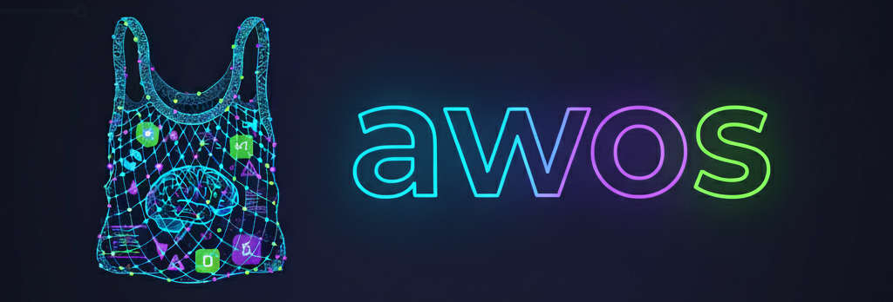

# **Agentic Workflow Operating System for Coding Assistance**

This framework outlines a structured approach to leveraging LLMs for high-quality code generation, moving beyond basic prompting to a spec-driven development methodology.

## 🚀 Quick Start: Your First Project with `awos`

Welcome to **`awos`**[^1]! This guide will walk you through building a new software product from idea to implementation using a series of simple commands.

### Before You Begin

To get started with **`awos`**, you'll need a couple of things set up first:

- **Node.js and npm**: You only need these to run the npx installer command and for future updates. The **`awos`** agents themselves do not require Node.js to operate once installed.

- **Claude Code**: This framework is designed and tested primarily for the Claude Code environment. While we've built it with other agentic systems in mind (and welcome contributions!), all examples assume you are using Claude Code.

**Important Note on Token Usage**: **`awos`** works by feeding large amounts of context from your project files to the AI. This can consume a significant number of tokens. Please plan your Claude subscription or AWS Bedrock usage accordingly to avoid unexpected costs/limits.

### Step 1: Install `awos`

First, open your terminal, create a new directory for your project, and run this single command. It will set up everything you need.

```sh
npx @provectusinc/awos
```

### Step 2: Follow the Workflow

**`awos`** guides you through a logical, step-by-step process. You'll use a series of "agents" to define, plan, and build your product. Run the commands in the following order.

1. `/awos:product`

- **What it does**: Creates the high-level Product Definition.
- **Think of it as**: Your project's main ID card. It answers the big questions: _What_ are we building, _why_, and for _who_?
- Audience: Product Owner (Non-Technical)

**Example Usage:**

```bash
# ✅ Good:
> /awos:product Build a photo editing app that adds beer and smiles to user photos using AI. Users want to create fun party photos to share on social media.

# ❌ Bad:
# too technical for product definition
> /awos:product Build an ML pipeline with TensorFlow for facial landmark detection and image compositing with alpha blending.
```

2. `/awos:roadmap`

- **What it does**: Creates the Product Roadmap.
- **Think of it as**: Your project's GPS. It lays out the features you will build and in what order.
- Audience: Product Manager (Non-Technical)

**Example Usage:**

```bash
# ✅ Good:
> /awos:roadmap Phase 1: Photo upload, Phase 2: Face detection, ...

# ❌ Bad:
# too granular and technical
> /awos:roadmap Sprint 1 Task #42: Implement YOLO v8 model inference endpoint
```

3. `/awos:architecture`

- **What it does**: Defines the System Architecture.
- **Think of it as**: Your project's building blueprint. It decides the technology stack, databases, infrastructure, etc.
- Audience: Solution Architect (Technical)

**Example Usage:**

```bash
# ✅ Good:
> /awos:architecture React frontend, Python Flask backend with OpenCV, AWS S3 for image storage, Lambda for processing

# ❌ Bad:
# describes features, not architecture
> /awos:architecture Users can upload photos and see beer added to their pictures.
```

4. `/awos:suggest-agents` **(Optional)**

- **What it does**: Analyzes your architecture and suggests domain expert subagents tailored to your tech stack.
- **Think of it as**: Assembling a team of specialists. Each subagent becomes an expert in a specific technology from your stack.
- Audience: Tech Lead (Technical)

**Example Usage:**

```bash
# ✅ Good:
> /awos:suggest-agents
# (It will analyze architecture.md and recommend relevant domain experts)
```

5. `/awos:spec`

- **What it does**: Creates a detailed Functional Specification for a single feature from the roadmap.
- **Think of it as**: A detailed plan for one room in your house. It describes exactly what the feature does for a user.
- Audience: Product Analyst (Non-Technical)

**Example Usage:**

```bash
# ✅ Good:
> /awos:spec
# (It will start working on the first incomplete checklist item in the roadmap)

# ✅ Good:
> /awos:spec Feature: Face Detection - System detects faces in uploaded image, highlights detected area with bounding box.

# ❌ Bad:
# implementation details, not user-facing functionality
> /awos:spec Implement multipart/form-data POST to /api/upload with JWT auth.

# ❌ Bad:
# too generic to implement
> /awos:spec Feature: Make the app work well.
```

6. `/awos:tech`

- **What it does**: Creates the Technical Specification.
- **Think of it as**: The builder's instructions for that one room. It explains _how_ to build the feature.
- Audience: Tech Lead (Technical)

**Example Usage:**

```bash
# ✅ Good:
> /awos:tech Use OpenCV's Haar Cascade for face detection, overlay PNG assets at detected coordinates, return processed image via presigned S3 URL

# ❌ Bad:
# describes outcome, not technical approach
> /awos:tech Make the photo upload smooth and fast for users.
```

7. `/awos:tasks`

- **What it does**: Breaks the technical spec into a Task List.
- **Think of it as**: The step-by-step construction checklist for engineers to follow.
- Audience: Tech Lead (Technical)

**Example Usage:**

```bash
# ✅ Good:
> /awos:tasks
# (It will create tasks for the spec created on the previous step)
```

8. `/awos:implement`

- **What it does**: Executes tasks (finally, actual code generation).
- **Think of it as**: The project foreman. This agent delegates the coding work to sub-agents and tracks progress.
- Audience: Team Lead (Technical)

**Example Usage:**

```bash
# ✅ Good:
> /awos:implement Implement all tasks

# ✅ Good:
> /awos:implement Implement Phase 2

# ✅ Good:
> /awos:implement
```

### Step 3: You're Awesome

That's it! By following these steps, you can systematically turn your vision into a well-defined and fully implemented product.

## The `awos` Philosophy

The **`awos`** framework is built on a simple but powerful idea: AI agents, like human developers, need clear context to do great work. Without a structured plan, even the most advanced LLM can act like a confused intern. **`awos`** provides a step-by-step workflow that transforms your vision into a detailed blueprint that AI agents can understand and execute flawlessly. This process ensures the AI's incredible speed is channeled into building the right software, correctly, on the first try.

➡️ [Read more about the philosophy behind **`awos`**](docs/rationale.md)

## The `awos` Document Structure

The **`awos`** workflow is built on a clear document structure that creates a traceable path from a high-level idea to a single line of code. By storing the project's entire state in files like the **Product Definition**, **Roadmap**, and **Specifications**, the entire process becomes idempotent. This is a powerful feature: you can clear your chat history at any time, and an **`awos`** agent can instantly restore the full project context from this single source of truth. This ensures that both humans and AI agents always have exactly the context they need to build the right thing.

➡️ [Learn more about the purpose of each document](docs/document-structure.md)

## Testing Strategies

The **`awos`** framework is flexible and non-prescriptive when it comes to testing. Teams can adopt the testing approach that best fits their project—whether that's TDD, BDD, integration testing, or a combination of strategies. The framework provides natural integration points in the workflow (like `/awos:tasks` and `/awos:implement`) where testing fits seamlessly.

➡️ [Explore testing strategies and customization options](docs/testing-strategies.md)

## What's Included in `awos`?

**`awos`** is a complete framework for agentic software development. It consists of four key components that work together to turn your ideas into code:

- 🚀 **An Installer**: A simple `npx` command that instantly sets up a new project. It creates all the necessary directories, templates, and configuration files, so you can start defining your product in minutes.

- 🤖 **A Set of AI Agents**: A suite of interactive commands (like `/awos:product`, `/awos:roadmap`, and `/awos:implement`). Each command is a specialized agent with a sophisticated prompt that guides you through a specific stage of the development lifecycle, from product definition to task execution.

- 🛠️ **Pre-defined Sub-Agents**: A collection of specialized AI workers that the main agents delegate tasks to. This includes sub-agents for coding, testing, and other utility functions, ensuring that the right "AI expert" is used for every job.

- 🔌 **Extensibility Hooks**: An advanced system for customization. Hooks and other configuration points allow you to modify and extend the framework to fit your team's specific workflow and needs (more decisions on this is coming soon).

## Customizing `awos`

The **`awos`** framework is designed to be both powerful out-of-the-box and highly customizable. Understanding how to safely customize the framework is key to making it work perfectly for your team.

### The `.awos` Folder: Framework Core (Do Not Edit)

All framework service data lives in the `.awos/` directory:

- `.awos/commands` - Full command prompt instructions
- `.awos/templates` - Document templates
- `.awos/scripts` - Utility scripts
- `.awos/subagents` - Detailed subagent prompts

**⚠️ Important:** Do NOT manually edit files in the `.awos/` folder. These files are always overwritten during updates to ensure you get the latest framework improvements. Any customizations here will be lost.

### The `.claude` Folder: Your Customization Layer

This is where you customize **`awos`** to fit your needs:

- **`.claude/commands/awos/{command}.md`** - Lightweight wrapper files that link to `.awos/commands/{command}.md`
- **`.claude/agents/{agent}.md`** - Agent configuration files that reference `.awos/subagents/{agent}.md`

These files are protected by default and won't be touched during normal updates.

### How to Customize

**Example: Customize a Command**

Open `.claude/commands/awos/implement.md` and add your instructions:

```diff
---
description: Runs tasks — delegates coding to sub-agents, tracks progress.
---

Refer to the instructions located in this file: .awos/commands/implement.md

+ - Always run tests after implementing each task
+ - Follow the code style guide in docs/style-guide.md
```

## Updating `awos`

### Normal Update

To update **`awos`** to the latest version, run the installer again:

```sh
npx @provectusinc/awos
```

**What gets updated:**

- ✅ Commands in `.awos/commands`
- ✅ Templates in `.awos/templates`
- ✅ Scripts in `.awos/scripts`
- ✅ Subagents in `.awos/subagents`

### Force Update

To update **`awos`** to the latest version, run the installer again with the `--force-overwrite` flag:

```sh
npx @provectusinc/awos --force-overwrite
```

**Important:** The `--force-overwrite` flag will overwrite existing files in `.claude/commands/awos` and `.claude/agents`.
If you've customized these files, make sure to back them up first, as your changes will be lost.

**What gets updated:**

- ✅ Commands in `.awos/commands`
- ✅ Templates in `.awos/templates`
- ✅ Scripts in `.awos/scripts`
- ✅ Subagents in `.awos/subagents`
- ⚠️ Commands in `.claude/commands/awos`
- ⚠️ Agents in `.claude/agents`

---

[^1]: The Russian word «авось» (a-VOHS’) doesn’t have a direct equivalent in English — it’s a very culturally loaded concept. It’s a mix of hope, chance, and fatalism, often with a sense of “let’s do it and maybe it will work out.”
