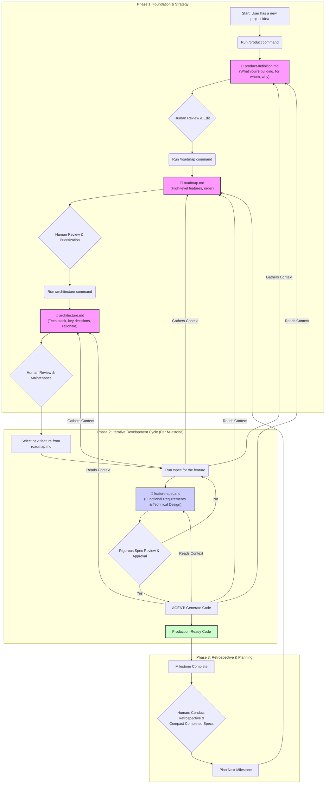

# Workflow Overview

This document outlines agentic workflow. It is designed to help you understand the process and how to use the framework.

## Overview
This flowchart visualizes the three key phases of your agentic workflow:

**Foundation & Strategy:** This initial phase sets the project's direction. It involves defining the product, creating a feature roadmap, and establishing the technical architecture. Each step produces a critical document that requires human review and input.

**Iterative Development Cycle:** This is the core loop where features are built. It begins by selecting a feature from the roadmap, creating a detailed specification, and getting it approved. Only after approval does the agent, armed with the full context from all foundational documents, generate the code.

**Retrospective & Planning:** This phase closes the loop, incorporating your note about working in milestones. After a milestone is complete, a retrospective is held, and the process feeds back into updating the roadmap to plan for the next cycle.

## Flow Diagram

